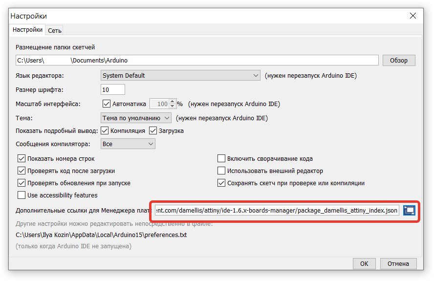
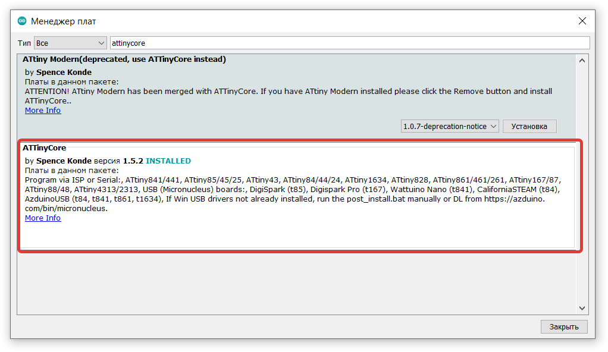
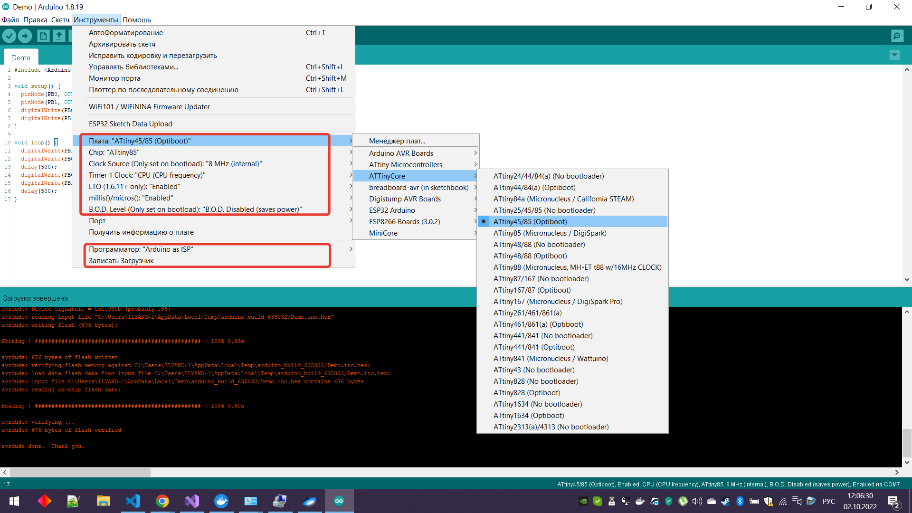

# Добавление в Arduino IDE поддержки ATTinyCore (ATTiny85)

Репозиторий на GitHub: https://github.com/SpenceKonde/ATTinyCore

* Добавляем ссылку
http://drazzy.com/package_drazzy.com_index.json
в настройки Arduino IDE

* Устанавливаем поддержку ATTinyCore

* Выбираем настройки платы

***ВАЖНО: перед заливкой программы, не забываем Записать загрузчик, через Arduino ISP***

