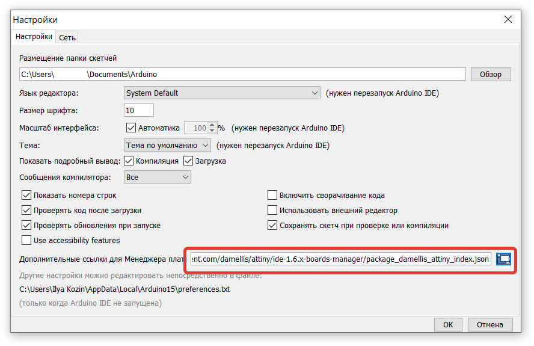
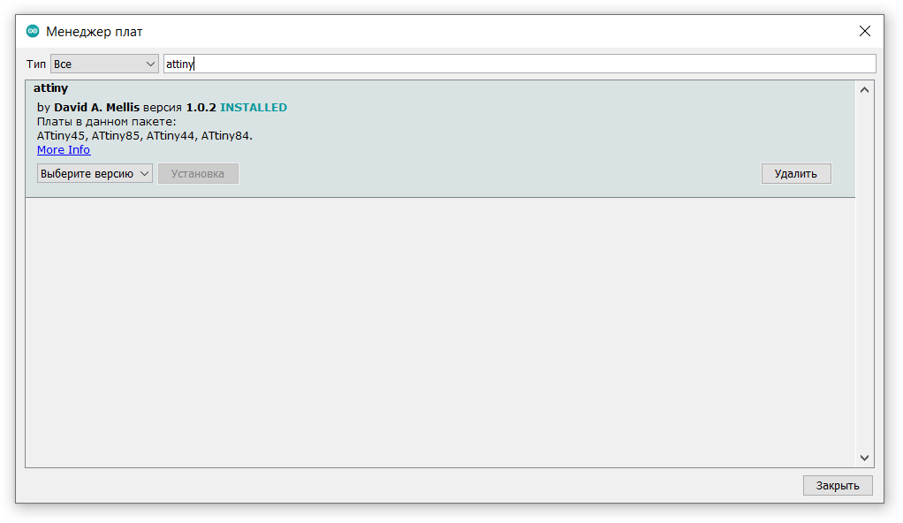
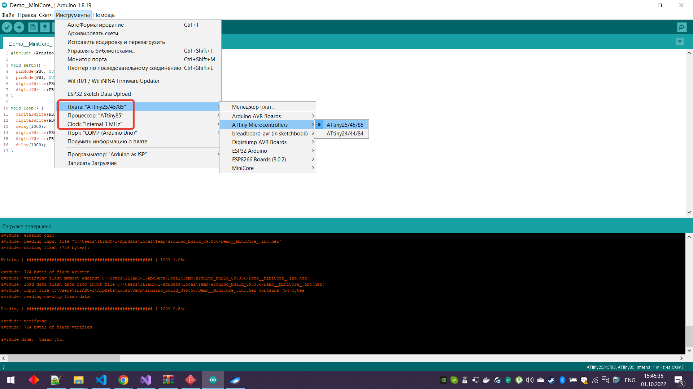

# Добавление в Arduino IDE поддержки ATTiny85

* Добавляем ссылку
https://raw.githubusercontent.com/damellis/attiny/ide-1.6.x-boards-manager/package_damellis_attiny_index.json
в настройки Arduino IDE

* Устанавливаем поддержку ATTiny

* Выбираем настройки платы

***ВАЖНО: перед заливкой программы, не забываем Записать загрузчик, например через Arduino ISP***

