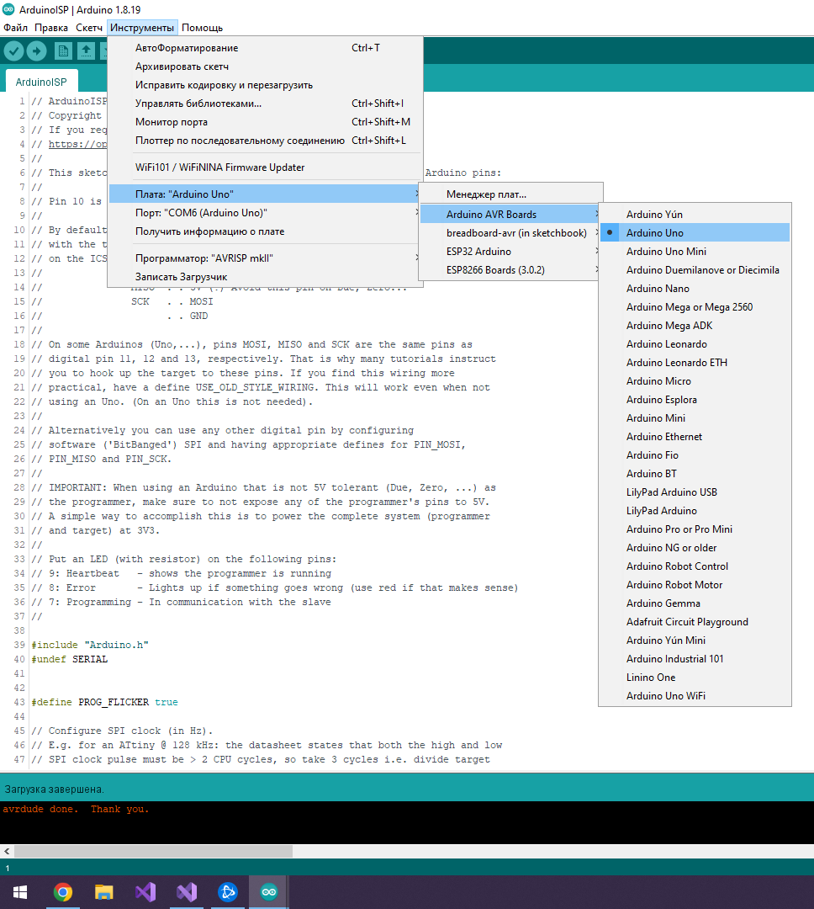
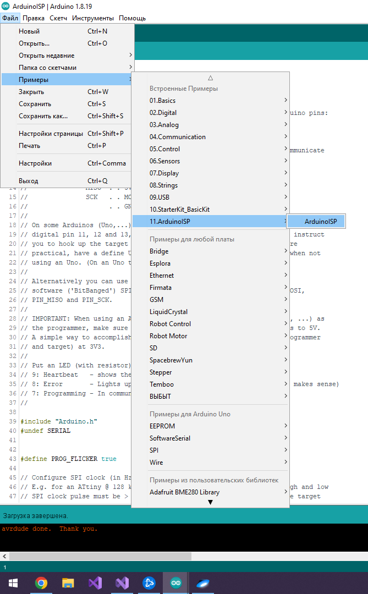
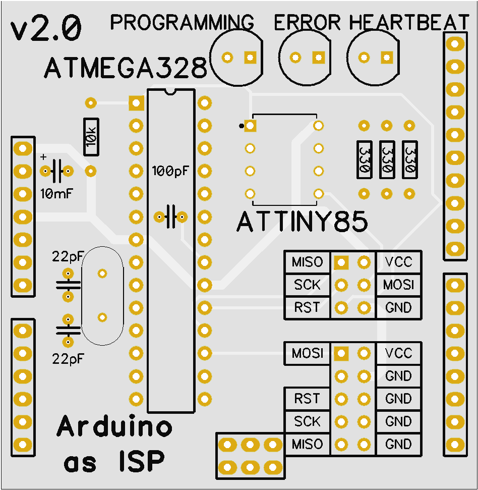
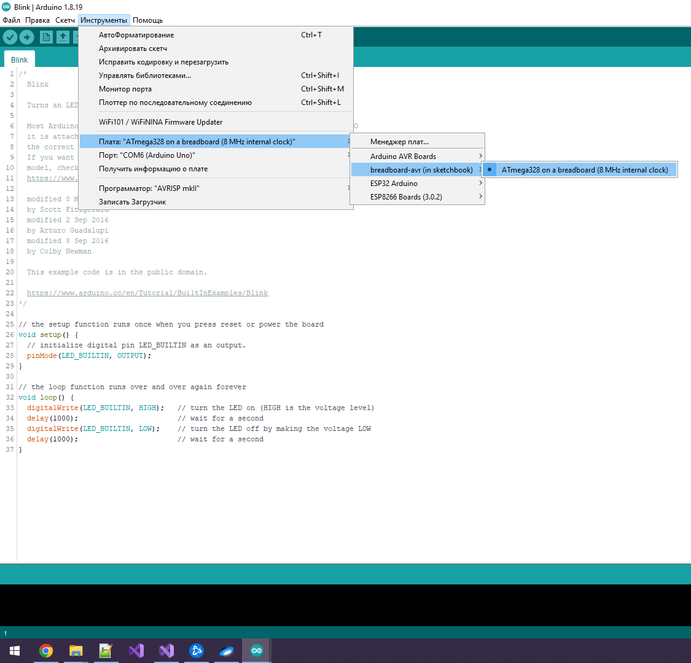
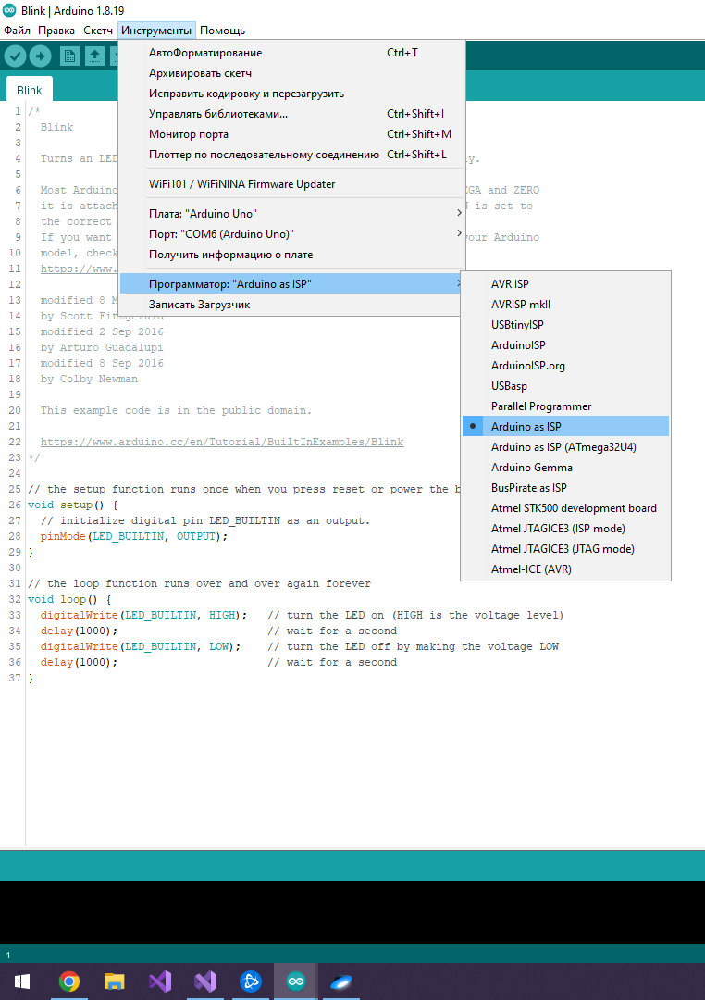
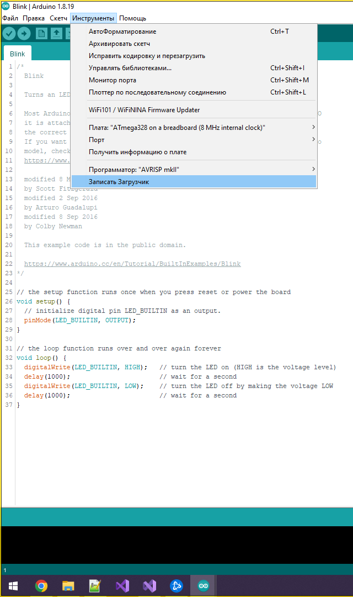
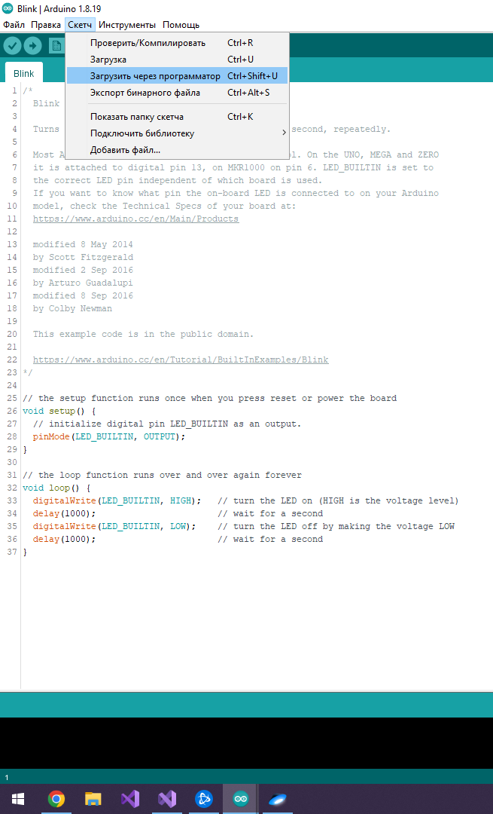

# 1. Подготовка Arduino в качестве программатора
Настраиваем Adruino которая будет выступать в роли программатора, для этого в IDE настраиваем плату и порт.

Открываем в IDE скетч ArduinoISP и заливаем его в Adruino

# 2. Подготовка к прошивке 
Отключив Arduino программатор от компьютера, подключаем к Adruino плату расширения для программирования и вставляем в нее микроконтроллел, в который будем записывать скетч.

Поключаем Arduino программатор к компьютеру и настраиваем IDE на установленный в плату расширения микроконтроллер

Выбираем в IDE в качестве программатора "Arduino as ISP"

# 3. Запись скетчка в микроконтроллер
*ВАЖНО если контроллер не содержит загрузчик, то в IDE выбираем "Записаит загрузчик"*

Открываем нужный скетч и в IDE выбираем "Загрузить через программатор"

