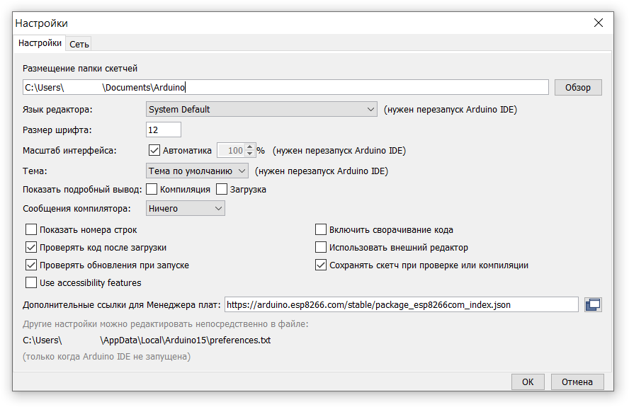

https://www.arduino.cc/en/Tutorial/BuiltInExamples/ArduinoToBreadboard
https://www.arduino.cc/en/uploads/Tutorial/breadboard-1-6-x.zip

Create a "hardware" sub-folder in your Arduino sketchbook folder (whose location you can find in the Arduino preferences dialog). If you've previously installed support for additional hardware configuration, you may already have a "hardware" folder in your sketchbook.

