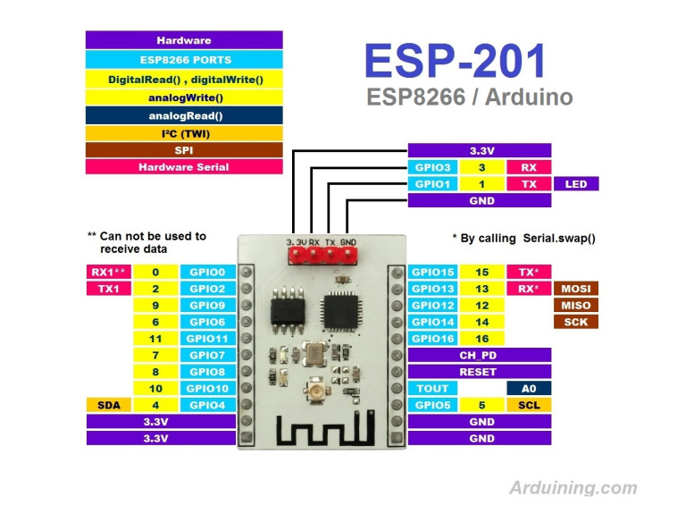
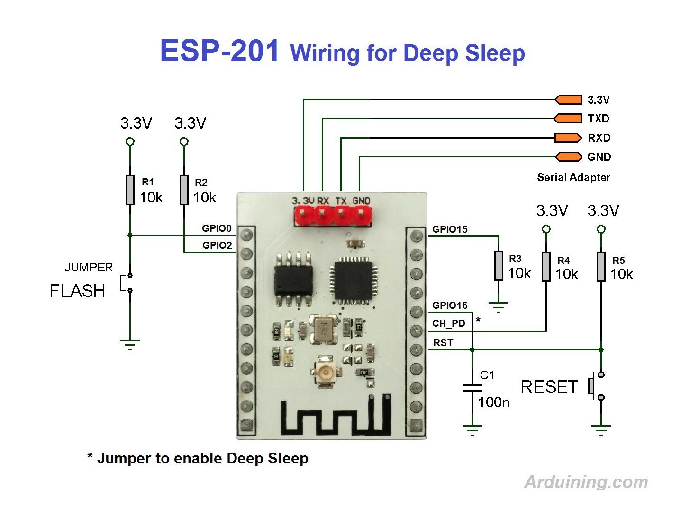

# ESP-201

## ESP8266 Режимы загрузки
|GPIO15|GPIO0|GPIO2|Режим  |Описание                    |
|:-:   |:-:  |:-:  |:-     |:-                         |
|  L   | L   | H   | UART  | Прошивка кода через UART |
|  L   | H   | H   | Flash | Загрузка c SPI Flash       |
|  H   | x   | x   | SDIO  | Загрузка c SD карты        |

