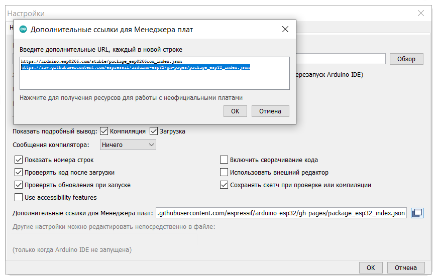
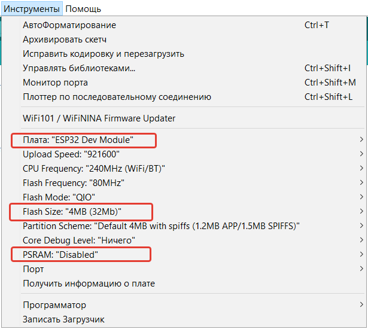

# ESP32

https://github.com/espressif/arduino-esp32

https://docs.espressif.com/projects/esp-idf/en/latest/esp32/

https://www.espressif.com/en/support/download/other-tools

https://diytech.ru/projects/spravochnik-po-raspinovke-esp32-kakie-vyvody-gpio-sleduet-ispolzovat

https://github.com/me-no-dev/arduino-esp32fs-plugin/releases

## Настройка Arduino IDE
Настройка менеджера плат в Arduino IDE

Стабильные релизы (stable release): https://raw.githubusercontent.com/espressif/arduino-esp32/gh-pages/package_esp32_index.json

Выпуски разработки (dev release):  https://raw.githubusercontent.com/espressif/arduino-esp32/gh-pages/package_esp32_dev_index.json

## Выбор платы в Arduino IDE

## Выбор платы T7 V1.3
ESP32 Arduino->TTGO T7 V1.3 Mini32

## Библиотеки Arduino IDE
Расположение: **"%USERPROFILE%\\Documents\\Arduino\\libraries\\"**

## Полезные библиотеки
https://github.com/bblanchon/ArduinoJson

https://github.com/me-no-dev/AsyncTCP

https://github.com/me-no-dev/ESPAsyncWebServer

https://github.com/LennartHennigs/Button2

https://github.com/madhephaestus/ESP32Encoder/

https://github.com/earlephilhower/ESP8266Audio

