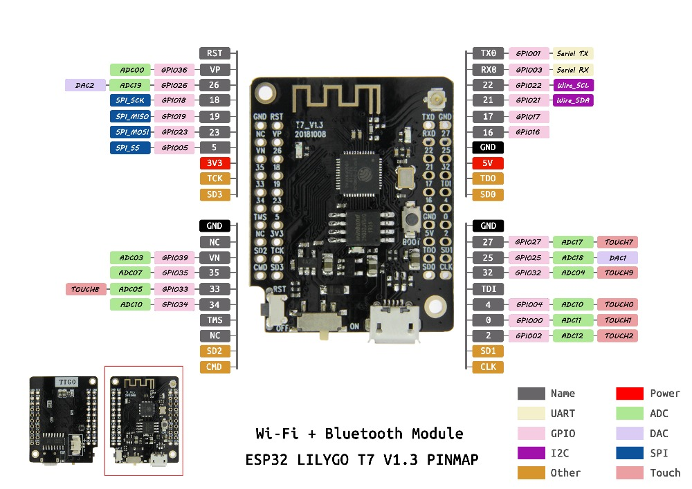

# TTGO T-7

Git: https://github.com/LilyGO/ESP32-MINI-32-V1.3

LILYGO® TTGO T7 V1.3 MINI 32 ESP32 WiFi Bluetooth Module Development Board

## Настройка Arduino IDE
**Описание настройки и выбора платы: [ESP32](../ESP32/readme.md)**

**ESP32 Arduino -> TTGO T7 V1.3 Mini32**

## Product Description

| Hardware                | Specifications |
| :-                      | :- |
| Main chip               | ESP 32 |
| Flash memory chip       | 25Q32 |
| Charging IC chip        | TP4054 |
| USB to serial port chip | CH340C |
| JST Connector           | 2Pin 1.25mm |

## CH340C USB to serial port
Website: http://www.wch.cn/download/CH341SER_ZIP.html

Скачать: [CH341SER.EXE](http://www.wch.cn/downloads/file/65.html)

