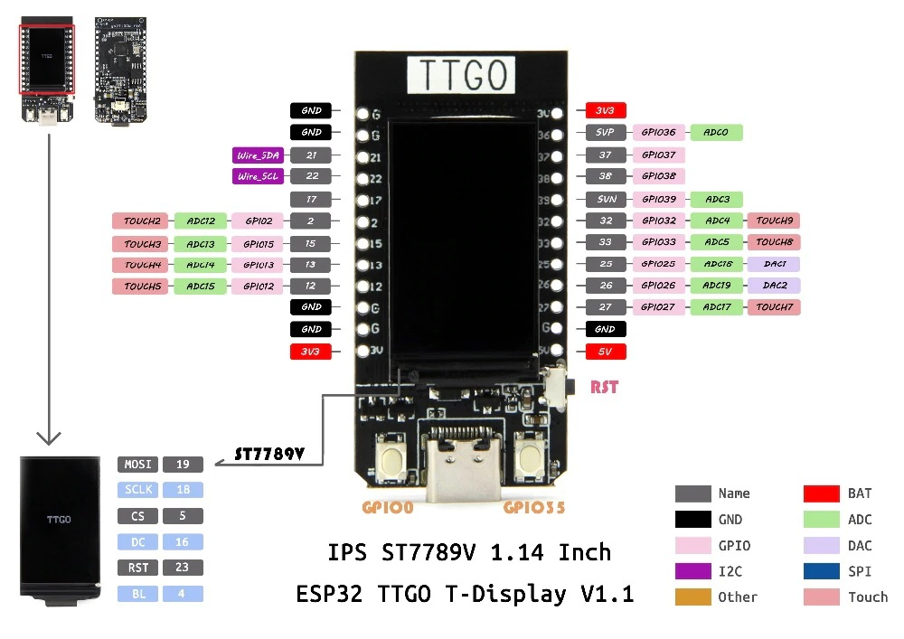

# TTGO T-Display

Git: https://github.com/Xinyuan-LilyGO/TTGO-T-Display

LILYGO® TTGO T-Display ESP32 WiFi and Bluetooth Module Development Board For Arduino 1.14 Inch LCD

https://github.com/espressif/arduino-esp32
https://docs.espressif.com/projects/esp-idf/en/latest/esp32/
https://www.sites.google.com/site/jmaathuis/arduino/lilygo-ttgo-t-display-esp32

Product  Description

| Hardware                    | Specifications |
| :-                          | :- |
| Chipset                     | ESPRESSIF-ESP32 240MHz Xtensa® single-/dual-core 32-bit LX6 microprocessor |
| FLASH                       | QSPI flash 4MB /16MB |
| SRAM                        | 520 kB SRAM |
| Button                      | Reset |
| USB to TTL                  | CP2104 |
| Modular interface           | UART、SPI、SDIO、I2C、LED PWM、TV PWM、I2S、IRGPIO、ADC、capacitor touch sensor、DACLNA  pre-amplifier |
| Display                     | IPS ST7789V 1.14 Inch |
| Working voltage             | 2.7V-4.2V |
| Working current             | About 67MA |
| Sleep current               | About 350uA |
| Working temperature range   | -40℃ ~ +85℃ |
| Size&Weight                 | 51.52*25.04*8.54mm(7.81g) |
| Power Supply Specifications | 
| Power Supply                | USB 5V/1A |
| Charging current            | 500mA |
| Battery                     | 3.7V lithium battery |
| JST Connector               | 2Pin 1.25mm |
| USB                         | Type-C |

| Wi-Fi                  | |
| :-                     | :- |
| Standard               | FCC/CE-RED/IC/TELEC/KCC/SRRC/NCC（esp32 chip）|
| Protocol               | 802.11 b/g/n(802.11n，speed up to150Mbps)A-MPDU and A-MSDU polymerization，support 0.4μS Protection interval |
| Frequency range        | 2.4GHz~2.5GHz(2400M~2483.5M) |
| Transmit Power         | 22dBm |
| Communication distance | 300m |

| Bluetooth       | |
| :-              | :- |
| Protocol        | Meet bluetooth v4.2BR/EDR and BLE standard |
| Radio frequency | With -97dBm sensitivity NZIF receiver Class-1,Class-2&Class-3 emitter AFH |
| Audio frequency | CVSD&SBC audio frequency |

| Software             | specification |
| :-                   | :- |
| Wi-Fi Mode           | Station/SoftAP/SoftAP+Station/P2P |
| Security mechanism   | WPA/WPA2/WPA2-Enterprise/WPS |
| Encryption Type      | AES/RSA/ECC/SHA |
| Firmware upgrade     | UART download/OTA（Through network/host to download and write firmware） |
| Software Development | Support cloud server development /SDK for user firmware development |
| Networking protocol  | IPv4、IPv6、SSL、TCP/UDP/HTTP/FTP/MQTT |
| User Configuration   | AT + Instruction set, cloud server, android/iOSapp |
| OS                   | FreeRTOS |

## Настройка Arduino IDE
Настройка менеджера плат в Arduino IDE
https://raw.githubusercontent.com/espressif/arduino-esp32/gh-pages/package_esp32_index.json

## Необходимые библиотеки
Библиотеки Arduino IDE: **"%USERPROFILE%\Documents\Arduino\libraries\"**
### [Button2](https://github.com/LennartHennigs/Button2)

### [TFT_eSPI](https://github.com/ikozin/Arduino/tree/master/LilyGO-TTGO/T-Display/TFT_eSPI/)
Оригинал библиотеки https://github.com/Bodmer/TFT_eSPI, подготовленная для T-Display https://github.com/Xinyuan-LilyGO/TTGO-T-Display/tree/master/TFT_eSPI/. Копия [TFT_eSPI](https://github.com/ikozin/Arduino/tree/master/LilyGO-TTGO/T-Display/TFT_eSPI/) (на 19 января 2021) 
## Выбор платы в Arduino IDE

## Скетч
Перед компиляцией необходимо установить локальную библиотеку **TFT_eSPI**,
для этого необходимо выполнить скрипт **deploy_TFT_eSPI.cmd**
После компиляции её нужно удалить выполнив скрипт **remove_TFT_eSPI.cmd**.

Скетч: [TTGO-T-Display.ino](https://github.com/ikozin/Arduino/tree/master/LilyGO-TTGO/T-Display/TTGO-T-Display/)

## CP2104 USB to UART Bridge Controller
Website: https://www.silabs.com/developers/usb-to-uart-bridge-vcp-drivers

Скачать: [CP210x Universal Windows Driver](https://www.silabs.com/documents/public/software/CP210x_Universal_Windows_Driver.zip)
