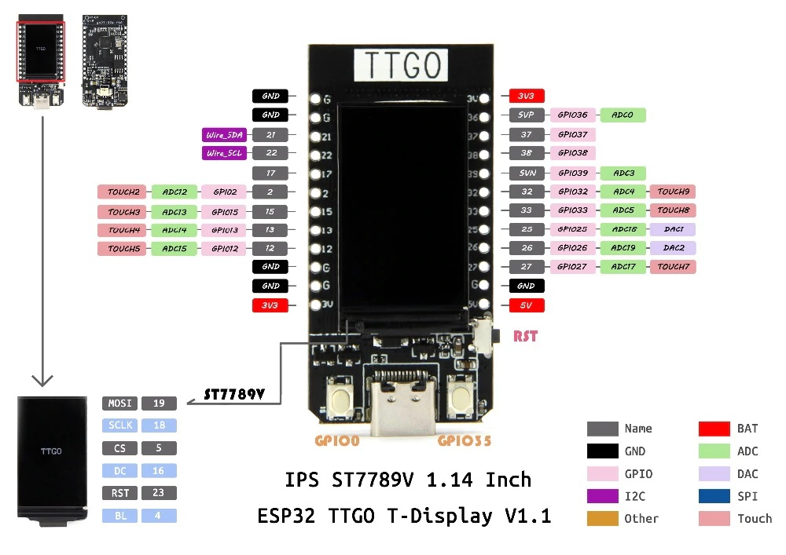
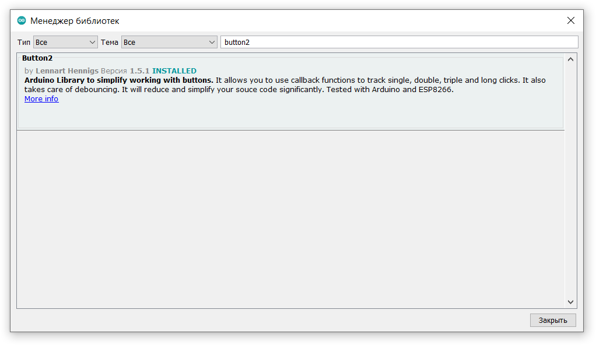
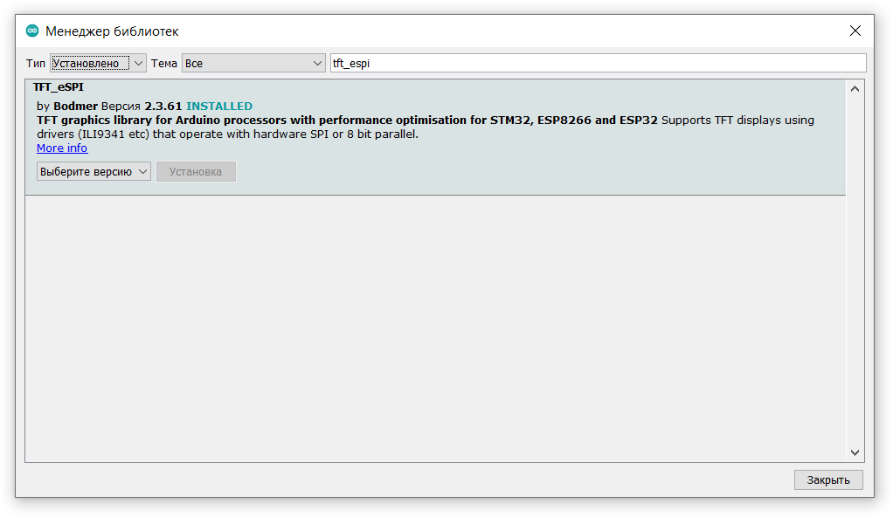

# TTGO T-Display

Git: https://github.com/Xinyuan-LilyGO/TTGO-T-Display

LILYGO® TTGO T-Display ESP32 WiFi and Bluetooth Module Development Board For Arduino 1.14 Inch LCD

https://www.sites.google.com/site/jmaathuis/arduino/lilygo-ttgo-t-display-esp32

## Настройка Arduino IDE
**Описание настройки и выбора платы: [ESP32](../ESP32/readme.md)**

## Product  Description

| Hardware                    | Specifications |
| :-                          | :- |
| Chipset                     | ESPRESSIF-ESP32 240MHz Xtensa® single-/dual-core 32-bit LX6 microprocessor |
| FLASH                       | QSPI flash 4MB /16MB |
| SRAM                        | 520 kB SRAM |
| Button                      | Reset |
| USB to TTL                  | CP2104 |
| Modular interface           | UART、SPI、SDIO、I2C、LED PWM、TV PWM、I2S、IRGPIO、ADC、capacitor touch sensor、DACLNA  pre-amplifier |
| Display                     | IPS ST7789V 1.14 Inch |
| Working voltage             | 2.7V-4.2V |
| Working current             | About 67MA |
| Sleep current               | About 350uA |
| Working temperature range   | -40℃ ~ +85℃ |
| Size&Weight                 | 51.52*25.04*8.54mm(7.81g) |
| Power Supply Specifications | 
| Power Supply                | USB 5V/1A |
| Charging current            | 500mA |
| Battery                     | 3.7V lithium battery |
| JST Connector               | 2Pin 1.25mm |
| USB                         | Type-C |

| Wi-Fi                  | |
| :-                     | :- |
| Standard               | FCC/CE-RED/IC/TELEC/KCC/SRRC/NCC（esp32 chip）|
| Protocol               | 802.11 b/g/n(802.11n，speed up to150Mbps)A-MPDU and A-MSDU polymerization，support 0.4μS Protection interval |
| Frequency range        | 2.4GHz~2.5GHz(2400M~2483.5M) |
| Transmit Power         | 22dBm |
| Communication distance | 300m |


| Bluetooth       | |
| :-              | :- |
| Protocol        | Meet bluetooth v4.2BR/EDR and BLE standard |
| Radio frequency | With -97dBm sensitivity NZIF receiver Class-1,Class-2&Class-3 emitter AFH |
| Audio frequency | CVSD&SBC audio frequency |


| Software             | specification |
| :-                   | :- |
| Wi-Fi Mode           | Station/SoftAP/SoftAP+Station/P2P |
| Security mechanism   | WPA/WPA2/WPA2-Enterprise/WPS |
| Encryption Type      | AES/RSA/ECC/SHA |
| Firmware upgrade     | UART download/OTA（Through network/host to download and write firmware） |
| Software Development | Support cloud server development /SDK for user firmware development |
| Networking protocol  | IPv4、IPv6、SSL、TCP/UDP/HTTP/FTP/MQTT |
| User Configuration   | AT + Instruction set, cloud server, android/iOSapp |
| OS                   | FreeRTOS |



## Необходимые библиотеки

### [ESP32FS](https://github.com/me-no-dev/arduino-esp32fs-plugin/releases)
Плагин для Arduino IDE, загружает файлы из директории Data в ESP32 flash memory

### [Button2](https://github.com/LennartHennigs/Button2)


### [TFT_eSPI](https://github.com/Bodmer/TFT_eSPI)
#### Оригинальная версия ####

**ПОСЛЕ УСТАНОВКИ НУЖНО ЕЁ НАСТРОИТЬ ПОД КОНКРЕТНУЮ ПЛАТУ, ДЛЯ ЭТОГО НЕОБХОДИМО В ДИРЕКТОРИИ**

%USERPROFILE%\Documents\Arduino\libraries\\TFT_eSPI\

**ОТРЕДАКТИРОВАТЬ ФАЙЛ __User_Setup_Select.h__ В КОТОРОМ ЗАКОМЕНТИРОВАТЬ СТРОКУ (нормер 22)**

```C++
//#include <User_Setup.h>
```

**И РАСКОМЕНТИРОВАТЬ СТРОКУ (номер 53)**

```C++
#include <User_Setups/Setup25_TTGO_T_Display.h>
```

#### Локальная версия ####
Оригинал библиотеки https://github.com/Bodmer/TFT_eSPI, подготовленная для T-Display https://github.com/Xinyuan-LilyGO/TTGO-T-Display/tree/master/TFT_eSPI/.
Копия [TFT_eSPI](https://github.com/ikozin/Arduino/tree/master/LilyGO-TTGO/T-Display/TFT_eSPI/) (на 19 января 2021) 
- установка библиотеки, **deploy_TFT_eSPI.cmd**
- удаление  библиотеки, **remove_TFT_eSPI.cmd**

### Заводской тест ###
Перед компиляцией необходимо установить локальную библиотеку **TFT_eSPI** : [FactoryTest](./TFT_eSPI/examples/FactoryTest/FactoryTest.ino)

## CP2104 USB to UART Bridge Controller
Website: https://www.silabs.com/developers/usb-to-uart-bridge-vcp-drivers

Скачать: [CP210x Universal Windows Driver](https://www.silabs.com/documents/public/software/CP210x_Universal_Windows_Driver.zip)

## Разное
ESP32 WROOM DevKit v1: распиновка, схема подключения и программирование - http://wiki.amperka.ru/products:esp32-wroom-wifi-devkit-v1

ESP32 - распиновка и характеристики: http://skproj.ru/esp32-raspinovka-i-harakteristiki/

Справочник по распиновке ESP32: Какие выводы GPIO следует использовать?: https://diytech.ru/projects/spravochnik-po-raspinovke-esp32-kakie-vyvody-gpio-sleduet-ispolzovat

ESP32 + Arduino Core + FreeRTOS + Blynk = дом с зачатками разума: https://habr.com/ru/post/479156/,
исходники статьи https://github.com/abashind/home_auto_2019

Интернет-радио ESP32 на декодере I2S PCM5102 - https://zen.yandex.ru/media/id/5d5ff446998ed600ad85b50c/internetradio-esp32-na-dekodere-i2s-pcm5102-5f80c3a6109c65627ebb6ca0

Интернет радио на ESP32 из Советского абонентского громкоговорителя ОРФЕЙ-311 1988г.: https://zen.yandex.ru/media/id/5d5ff446998ed600ad85b50c/internet-radio-na-esp32-iz-sovetskogo-abonentskogo-gromkogovoritelia-orfei311-1988g-5f85b18c3940476c667d0e3b

Arduino core for the ESP32 - https://github.com/espressif/arduino-esp32

Arduino ESP32 filesystem uploader - https://github.com/me-no-dev/arduino-esp32fs-plugin

ESP32 Встроенный сенсорный интерфейс - https://zen.yandex.ru/media/id/5d5ff446998ed600ad85b50c/esp32-vstroennyi-sensornyi-interfeis-5f665680c833846a1dd152f3

ПОДКЛЮЧЕНИЕ ЭНКОДЕРА К ARDUINO: https://alexgyver.ru/encoder/

ESP32 и файловая система SPIFFS: https://habr.com/ru/post/483280/

WI-FI интернет радио: https://4pda.ru/forum/index.php?showtopic=1010378&st=40


How to Install and Setup TTGO T-Display (Getting Started tutorial) - https://www.youtube.com/watch?v=b8254--ibmM

TTGO T-Display Board (ESP32) BRAKEOUT Game - https://www.youtube.com/watch?v=N6V7ZJkhSbc

TTGO T Display (ESP32) - Space Shooter game- free code - https://www.youtube.com/watch?v=KZMkGDyGjxQ&t=0s

