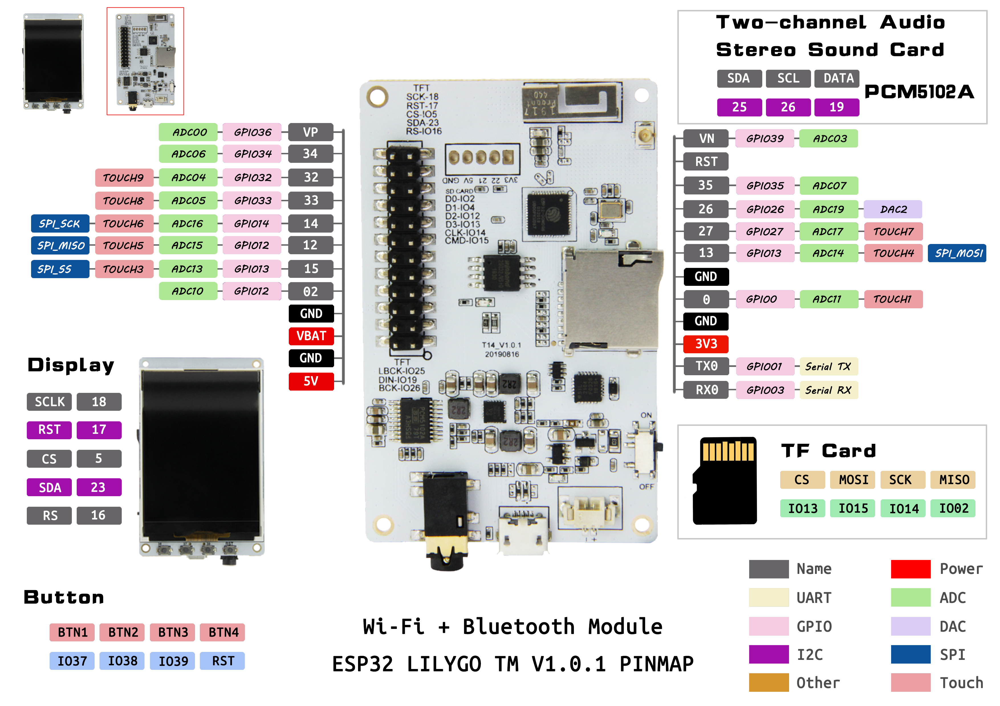
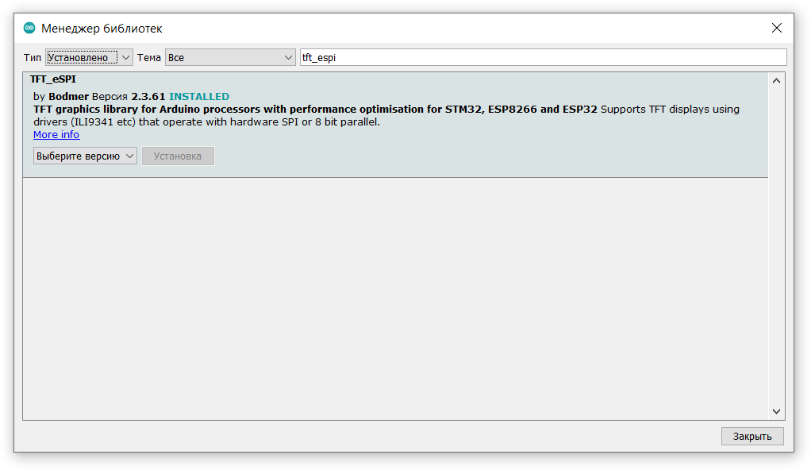

# TTGO TM

Git: https://github.com/LilyGO/TTGO-TM-ESP32

LILYGO® TTGO Tm Music Albums 2.4 Inch PCM5102A SD Card ESP32 WiFi And Bluetooth Module

http://www.lilygo.cn/prod_view.aspx?TypeId=50032&Id=1157

## Настройка Arduino IDE
**Описание настройки и выбора платы: [ESP32](../ESP32/readme.md)**


## Product  Description



| Name       | V1           |
| :-         | :-           |
|            | **ST7789**   |
| TFT_MISO   | N/A          |
| TFT_MOSI   | 23           |
| TFT_SCLK   | 18           |
| TFT_CS     | 5            |
| TFT_DC     | 16           |
| TFT_RST    | 17           |
|            | **I2C**      |
| I2C_SDA    | 21           |
| I2C_SCL    | 22           |
|            | **BUTTONS**  |
| BTN1       | 37           |
| BTN2       | 38           |
| BTN3       | 39           |
| BTN4       | RST          |
|            | **PCM5102A** |
| LCK        | 25           |
| DIN        | 19           |
| BCK        | 26           |
|            | **TF Card**  |
| DAT0       | 2            |
| DAT1       | 4            |
| DAT2       | 12           |
| DAT3       | 13           |
| CLK        | 14           |
| CMD        | 15           |

## Необходимые библиотеки

### [ESP32FS](https://github.com/me-no-dev/arduino-esp32fs-plugin/releases)
Плагин для Arduino IDE, загружает файлы из директории Data в ESP32 flash memory

### [TFT_eSPI (предпочтительно по скорости)](https://github.com/Bodmer/TFT_eSPI)

**ПОСЛЕ УСТАНОВКИ НУЖНО ЕЁ НАСТРОИТЬ ПОД КОНКРЕТНУЮ ПЛАТУ, ДЛЯ ЭТОГО НЕОБХОДИМО В ДИРЕКТОРИИ**

%USERPROFILE%\Documents\Arduino\libraries\\TFT_eSPI\

**ОТРЕДАКТИРОВАТЬ ФАЙЛ __User_Setup_Select.h__ В КОТОРОМ ЗАКОМЕНТИРОВАТЬ СТРОКУ (нормер 22)**

```C++
//#include <User_Setup.h>
```

**И РАСКОМЕНТИРОВАТЬ СТРОКУ (номер 51)**

```C++
#include <User_Setups/Setup23_TTGO_TM.h>
```

### [Adafruit ST7735 and ST7789](https://github.com/adafruit/Adafruit-ST7735-Library)

Пример использования:
```C++
#include <Adafruit_GFX.h>    // Core graphics library
#include <Adafruit_ST7789.h> // Hardware-specific library for ST7789
#include <SPI.h>

#define TFT_MISO  -1
#define TFT_MOSI  23
#define TFT_SCLK  18
#define TFT_CS    5
#define TFT_DC    16
#define TFT_RST   17

Adafruit_ST7789 tft = Adafruit_ST7789(TFT_CS, TFT_DC, TFT_MOSI, TFT_SCLK, TFT_RST);

tft.init(240, 320);
```

