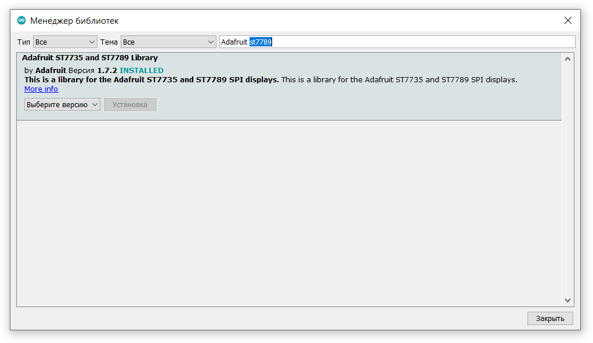

# TTGO TM

Git: https://github.com/LilyGO/TTGO-TM-ESP32

LILYGO® TTGO Tm Music Albums 2.4 Inch PCM5102A SD Card ESP32 WiFi And Bluetooth Module

http://www.lilygo.cn/prod_view.aspx?TypeId=50032&Id=1157

## Настройка Arduino IDE
**Описание настройки и выбора платы: [ESP32](../ESP32/readme.md)**

## Необходимые библиотеки

### [ESP32FS](https://github.com/me-no-dev/arduino-esp32fs-plugin/releases)
Плагин для Arduino IDE, загружает файлы из директории Data в ESP32 flash memory

### [Adafruit ST7735 and ST7789](https://github.com/adafruit/Adafruit-ST7735-Library)

