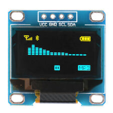

---
|Директория|Описание|
|:-:|:- |
|   24LC16 | Плата расширения для I2C EEPROM 24LC02 - 24LC16. Запись возврастающего значения 0-255 с последующим чтением |
|   24LC32 | Плата расширения для I2C EEPROM 24LC32 - 24LC512. Запись возврастающего значения 0-255 с последующим чтением |
|  AM2301 | Датчик температуры и влажности AM2301 |
| AT28C256 | Paraller EEPROM AT28C256. Чтение 2КБ или 32КБ, используется Arduino MEGA 2560 + набор шлейфов |
| ATMEGA328 | Время/Температура/Влажность, используется ATMEGA328 (8MHz internal clock), HS410561K-32, DS3231, AM2301AM |
| BCD | Функции конвертировния BCD |
|  BLUNO | Bluno v1.6 от DFRobot - все время пытается подключиться как USB диск |
|  DS1302 | DS1302 |
|  DS3231 | DS3231 |
| EEPROM | Программатор для Paraller EEPROM AT28C256, используется Arduino MEGA 2560 + набор шлейфов + Micro SD |
|  HC-05 (Bluetooth) | работа с модулем Bluetooth HC-05 |
|  HS410561K-32 | 4-разрядный 7-сегментный индикатор с общим анодом |
|  Joystick | Аналоговый джойстик + Змейка на Processig |
|  573РФ2 | Плата расширения для ППЗУ К573РФ2, содержит логику управления напряжением прошивки, для работы необходим повышающий DC-DC |
|  Keyboard4x4 | Клавиатура 4 x 4 |
| KitchenStation |  |
|  1533ИР24x2 | Плата расширения для регистра сдвига К1533ИР24, содержит 2 регистра (16 бит), с подтягивающими резисторами на входах управления |
|  LED8x8 - 1588AS | Светодиодная матрица 8x8 красная (LED8x8) |
| Matrix |  |
|  SSD1306 | I2C - OLED_I2C, SPI - Adafruit_SPI |
|   PCF8574 | Плата расширения для 8-bit I/O expander (I2C) PCF8574 |
|  PCF8574_Button | Плата расширения для 8-bit I/O expander (I2C) PCF8574, расширитель клавиатуры - 8 кнопок |
| Programmer573RF2 | Программатор для ППЗУ К573РФ2, использует платы расширения: "1533ИР24x2", "573РФ2", "PCF8574", "PCF8574_Button", SD Card |
| Radio |  |
| УМС | Плата расширения для УМС-7, УМС-8 |
