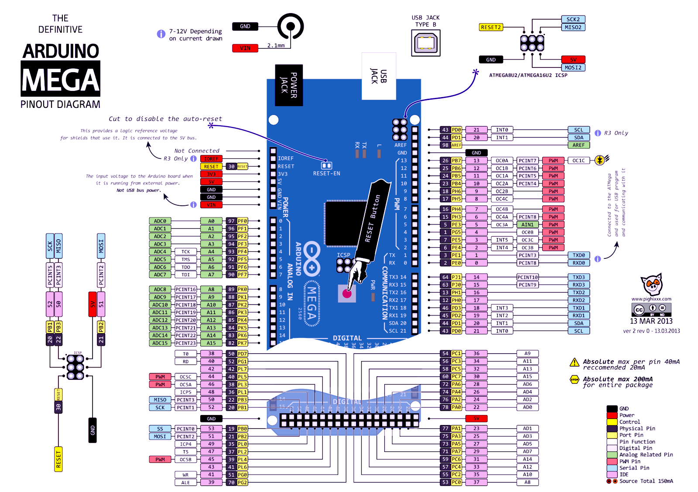

## Arduino Mega 2560

## Журнал Радио
Программатор микросхем ПЗУ - **Радио 1995**, **№10**, **стр. 22**

Простой программатор для "Радои86-РК" - **Радио 1996**, **№12**, **стр. 26**

## В Помощь Радиолюбителю
Программатор ППЗУ со стиранием ультрафиолетовым излучением - **В Помощь Радиолюбителю**, **№113**, **стр. 56**

## Internet
[Простой копировщик РПЗУ К573РФ2(5)](https://vip-cxema.org/index.php/home/mikrokontrollery/357-prostoj-kopirovshchik-rpzu-k573rf2-5)
